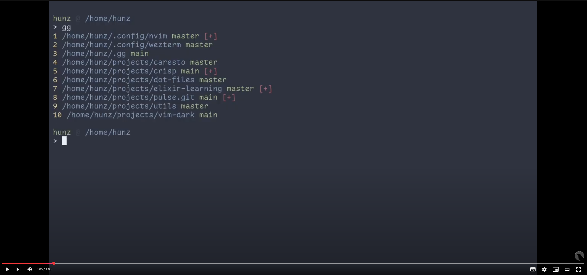

# gg

One command for all your git repos.

[](https://www.youtube.com/watch?v=l_nR-X2K5Kk)


## Install

YOLO
```sh
curl -fsSL https://raw.githubusercontent.com/thiago-negri/gg/refs/heads/main/install.sh | bash
```


## Usage


### List all
List all repositories, with branch and dirty flag.
```
gg
```

Output is a list of repositories in format:
```
<ID> <DIRECTORY> <BRANCH> <DIRTY_FLAG>
```

Example:
```
$ gg
1 /home/hunz/.config/nvim master [+]
2 /home/hunz/.config/wezterm master [+]
3 /home/hunz/.fzf master
4 /home/hunz/.gg main [+]
5 /home/hunz/.nvm HEAD
6 /home/hunz/projects/caresto master
7 /home/hunz/projects/crisp main [+]
8 /home/hunz/projects/dot-files master [+]
9 /home/hunz/projects/elixir-learning master [+]
10 /home/hunz/projects/pulse.git main [+]
11 /home/hunz/projects/utils master
12 /home/hunz/projects/vim-dark main
```


### CD to a repo
Change to a repository directory using its ID.
```
gg <ID>
```

Examples:
```
$ gg 3
$ pwd
/home/hunz/.fzf

$ gg 8
$ pwd
/home/hunz/projects/dot-files
```


### Execute command in one repo
Execute a command in a repository from anywhere without leaving your current working directory.
```
gg <ID> <COMMAND>
```

Examples:
```
$ pwd
/home/hunz/projects/dot-files

$ gg 1 status -s
1 /home/hunz/.config/nvim: git status -s
D  LICENSE.md
 D README.md
 D init.lua
?? init-old.lua
?? init-oldold.lua
?? plugins/

$ gg 1 add init.lua
1 /home/hunz/.config/nvim: git add init.lua

$ gg 1 status -s
1 /home/hunz/.config/nvim: git status -s
D  LICENSE.md
 D README.md
D  init.lua
?? init-old.lua
?? init-oldold.lua
?? plugins/

$ gg 1 reset --hard HEAD
1 /home/hunz/.config/nvim: git reset --hard HEAD
HEAD is now at 70f4ea6 trying nord colorscheme

$ gg 1 status -s
1 /home/hunz/.config/nvim: git status -s
?? init-old.lua
?? init-oldold.lua
?? plugins/

$ pwd
/home/hunz/projects/dot-files
```


### Execute command in all repos
Execute a command in all your repositories without leaving your current working directory.
```
gg <COMMAND>
```

Examples:
```
$ gg fetch
1 /home/hunz/.config/nvim: git fetch
2 /home/hunz/.config/wezterm: git fetch
3 /home/hunz/.fzf: git fetch
4 /home/hunz/.gg: git fetch
5 /home/hunz/.nvm: git fetch
6 /home/hunz/projects/caresto: git fetch
7 /home/hunz/projects/crisp: git fetch
8 /home/hunz/projects/dot-files: git fetch
9 /home/hunz/projects/elixir-learning: git fetch
10 /home/hunz/projects/pulse.git: git fetch
11 /home/hunz/projects/utils: git fetch
12 /home/hunz/projects/vim-dark: git fetch
```

```
$ gg status -s
1 /home/hunz/.config/nvim: git status -s
 D README.md
 M init.lua
?? plugins/
2 /home/hunz/.config/wezterm: git status -s
 M sessionizer.lua
3 /home/hunz/.fzf: git status -s
4 /home/hunz/.gg: git status -s
5 /home/hunz/.nvm: git status -s
6 /home/hunz/projects/caresto: git status -s
7 /home/hunz/projects/crisp: git status -s
?? input.crisp
8 /home/hunz/projects/dot-files: git status -s
9 /home/hunz/projects/elixir-learning: git status -s
?? erl_crash.dump
?? hello.exs
10 /home/hunz/projects/pulse.git: git status -s
 M .nvimrc
11 /home/hunz/projects/utils: git status -s
12 /home/hunz/projects/vim-dark: git status -s
```


## Customization

By default it will only find git repositories in your home folder, up to 3 directories deep.

If you want to change the list of repositories that `gg` operates on, provide your own version
of `gg-find` function before sourcing `gg.zsh` in your `.zshrc` file.

That function should return all the repositories listed, one for each line.
You probably want to sort them in a way so the repository IDs doesn't change every time you
list your repositories.

The default implementation is at the very top of [gg.zsh](gg.zsh) file, you may use it to
create your own.

Here's an example of a list of static git repositories:
```sh
gg-find() {
  echo "$HOME/projects/foo"
  echo "$HOME/.config/bar"
}
```

Here's a sample implementation that would search multiple directories, you may simply add more
paths after `"$HOME"`:
```sh
gg-find() {
    local folders=(
        "$HOME"
        # Add your paths here ...
    )
    find "${folders[@]}" -maxdepth 3 -type d -name .git -exec dirname '{}' \; | sort -u
}
```

So your `.zshrc` will look something like this:
```sh
gg-find() {
    local folders=(
        "$HOME"
        "$HOME/my/super/secret/repository"
        "/home/alice/projects"
    )
    find "${folders[@]}" -maxdepth 3 -type d -name .git -exec dirname '{}' \; | sort -u
}
source "$HOME/.gg/gg.zsh"
```

Remember you need to reload your `.zshrc` to see your changes in effect (e.g. `exec zsh`).


## Cache

The list of repositories is built and cached when you first call `gg`.
That cache is only refreshed when you call `gg` without any arguments.

This means two very important things:
1. New repositories will not show up on the list until you call `gg` again;
2. If you're chaining multiple commands to the same repo, you are safe that the ID of the repository will not change.

If you want to list the repositories without rebuilding the list (i.e. querying from the cache), use `gg ls` command.

The cache is stored in a file `$GG_CACHE_FILE`, which by default is `"$HOME/.gg/.cache"`, you may change that location
by setting that variable before sourcing `gg.zshrc`, same as you would do to customize `gg-find`.

So your fully customized `.zshrc` may look something like this:
```sh
gg-find() {
    local folders=(
        "$HOME"
        "$HOME/my/super/secret/repository"
        "/home/alice/projects"
    )
    find "${folders[@]}" -maxdepth 3 -type d -name .git -exec dirname '{}' \; | sort -u
}
GG_CACHE_FILE="$HOME/.gg_cache_file"
source "$HOME/.gg/gg.zsh"
```


## Uninstall

```sh
sed -i '/^source "$HOME\/.gg\/gg.zsh"/d' "$HOME/.zshrc"
rm -rf "$HOME/.gg"
```

If you have any customization (`gg-find`, or `GG_CACHE_FILE`), you'll need to delete those yourself.
